<!--
  ╔══════════════════════════════════════════════════════════════════════╗
  ║  abd·orange — GitHub profile README                                   ║
  ║  All artwork in ./assets is self-contained animated SVG (no scripts,  ║
  ║  no external calls). Backgrounds are #0d1117 (GitHub's dark canvas)    ║
  ║  so every asset blends seamlessly with the page — no visible boxes.    ║
  ║  Tuned for GitHub DARK mode. Deploy notes: see DEPLOY.md               ║
  ╚══════════════════════════════════════════════════════════════════════╝
-->



 



 


<a href="https://www.abdorange.me"></a>

<a href="https://www.abdorange.me"></a>

 



18 records verified — awards, publications, features &amp; talks. Full ledger at <b><a href="https://www.abdorange.me">abdorange.me</a></b>.

 



<!-- SNAKE — optional dynamic touch. Activate the workflow in .github/workflows/snake.yml (see DEPLOY.md);
     it appears once the `output` branch exists. Until then GitHub shows a broken image, so it stays
     commented out by default — uncomment after your first Action run. -->
<!--

  <picture>
    <source media="(prefers-color-scheme: dark)" srcset="https://raw.githubusercontent.com/abdelrahman18036/abdelrahman18036/output/github-snake-dark.svg" />
    <source media="(prefers-color-scheme: light)" srcset="https://raw.githubusercontent.com/abdelrahman18036/abdelrahman18036/output/github-snake.svg" />
    
  </picture>

-->

 


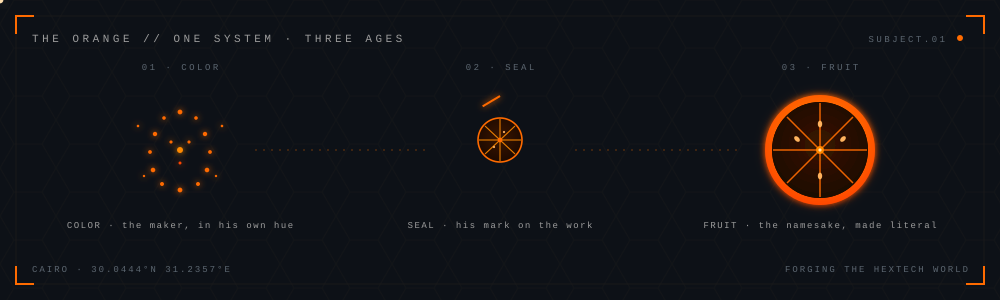

<a href="https://www.abdorange.me"></a>

 


 


